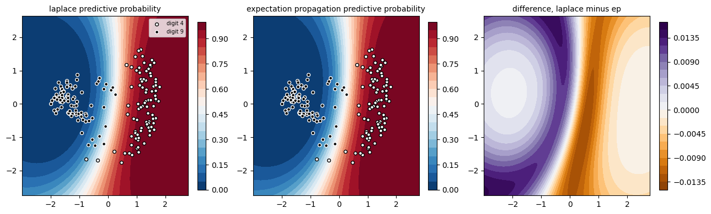
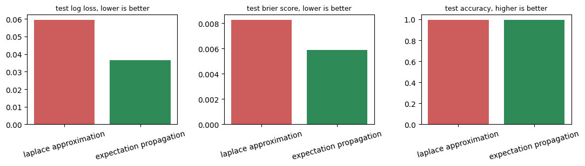

# Laplace Approximation versus Expectation Propagation

## Problem Statement

Gaussian process classification does not have a closed form posterior over
the latent function, unlike Gaussian process regression, since the class
label is connected to the latent function through a non Gaussian
likelihood such as the probit function. This project follows chapter three
of Rasmussen and Williams, Gaussian Processes for Machine Learning, which
introduces two classic approximate inference schemes for this problem, the
Laplace approximation and expectation propagation, commonly written as EP.
Both methods are implemented from scratch following the book's equations
and algorithms, then compared head to head on a real binary classification
task, distinguishing handwritten digit four from handwritten digit nine
using the scikit learn digits dataset, mirroring the same digit
classification experiment used in section 3.7.3 of the book.

## Approach

* Loaded the scikit learn digits dataset and filtered it down to only the
  digit four and digit nine classes, since these two digits are visually
  similar enough to make the classification task genuinely non trivial.
* Placed a zero mean Gaussian process prior on a latent function and
  connected it to the binary label through the probit likelihood, with a
  squared exponential covariance function controlling smoothness.
* Implemented the Laplace approximation from scratch, using Newton
  iteration to find the posterior mode over the latent values and then
  approximating the posterior locally around that mode with a Gaussian
  whose covariance is the inverse Hessian of the negative log posterior,
  following Algorithm 3.1 in the book.
* Implemented expectation propagation from scratch, approximating each
  individual likelihood term with its own local Gaussian site function,
  refined one at a time through a cavity distribution and moment matching
  over repeated sweeps until convergence, following Algorithm 3.5 in the
  book.
* Reduced the sixty four raw pixel features to eight principal components
  before building the covariance matrix, keeping the kernel computation
  fast while preserving most of the shape information that separates a
  four from a nine.
* Selected kernel hyperparameters, length scale and signal variance,
  separately for each method through a grid search that maximizes each
  method's own approximate log marginal likelihood.
* Compared both methods on a held out test set using classification
  accuracy, log loss, Brier score, and a reliability diagram, and
  additionally visualized the predictive probability surface of each
  method in a two dimensional principal component projection.

## Results

This figure shows the predictive probability surface of each method
across a two dimensional principal component projection of the digit
features, with the training points for each digit overlaid, plus a third
panel showing the difference between the two surfaces. Both methods agree
almost everywhere on which side of the decision boundary a point falls,
but the difference panel reveals a consistent, smooth divergence in how
confidently each method extrapolates away from the training data, with
Laplace and EP disagreeing most in the regions furthest from the bulk of
the training points.

This bar chart compares test log loss, test Brier score, and test
accuracy between the two methods. Both methods reach almost identical
classification accuracy, since accuracy only depends on which side of
probability one half a prediction falls, but expectation propagation
achieves a noticeably lower log loss and lower Brier score, meaning its
predicted probabilities are better calibrated even though its hard
classification decisions agree with Laplace almost every time.

## Notebooks

1. LPvsEP.ipynb, containing the from scratch Laplace approximation and
   expectation propagation implementations, kernel hyperparameter
   selection through approximate log marginal likelihood, and the full
   comparison on the held out digit four versus digit nine test set,
   including a reliability diagram and a single site view explaining why
   expectation propagation tends to produce better calibrated
   probabilities than the Laplace approximation.

## Limitations and Next Steps

* The comparison uses only eight principal components of the original
  sixty four pixel features, so some fine grained shape information that
  could further separate the two digits is discarded before the kernel
  ever sees the data.
* Kernel hyperparameters are chosen from a coarse grid search over only a
  handful of length scale and signal variance combinations, rather than a
  continuous optimization of the approximate log marginal likelihood, so
  the reported comparison may not reflect each method at its true best
  setting.
* Both methods are compared on a single train and test split, so the
  reported metrics do not capture how much the comparison might vary
  across different random splits of the data.
* Next steps include extending the comparison to a harder multi digit
  classification problem, and studying how the gap between Laplace and
  expectation propagation calibration changes as the amount of training
  data grows, since the book's own discussion suggests the two methods
  converge as the posterior becomes more Gaussian with more data.
