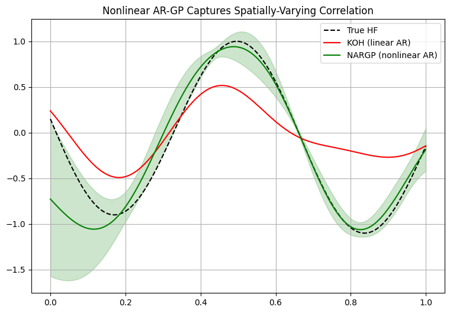
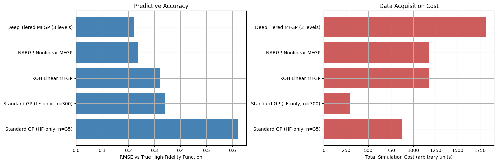

# MFGP Multi Fidelity Surrogate: Combining Cheap and Expensive Simulations

## Problem Statement

Many engineering and scientific problems have two or more simulation
fidelities available. Low fidelity simulations are cheap and can be run
thousands of times, but are approximate. High fidelity simulations are
accurate but expensive, so only a small number of samples are affordable.
Using high fidelity data alone wastes the abundant low fidelity information;
using low fidelity data alone gives biased results.

This project explores Multi Fidelity Gaussian Processes (MFGP), a family of
methods that combine both data sources into a single probabilistic model,
achieving high fidelity level accuracy while requiring far fewer expensive
high fidelity samples.

## Approach

The notebook builds understanding progressively, from a naive baseline to
increasingly capable multi fidelity architectures.

* Standard GP (high fidelity only): a Gaussian Process trained only on the
  scarce high fidelity data, establishing a baseline that suffers from
  sparse data coverage.
* Uncertainty propagation through nonlinear maps: demonstrates empirically,
  using Monte Carlo sampling, that passing a Gaussian distribution through
  a nonlinear function destroys its Gaussian shape.
* Deep GP composition: compares a naive plug in approach against Monte
  Carlo propagated composition, which correctly carries uncertainty through
  stacked Gaussian Processes.
* Linear autoregressive MFGP (Kennedy O'Hagan): assumes the high fidelity
  function is a scaled copy of the low fidelity function plus an
  independent correction term.
* Nonlinear autoregressive GP (NARGP): replaces the fixed linear scaling
  with a second GP that learns an arbitrary nonlinear relationship between
  fidelity levels.
* Deep tiered MFGP: extends the approach across three fidelity tiers,
  propagating uncertainty at every level.

## Results

### Why the linear model breaks down

The low fidelity simulator was deliberately built with a correlation
strength to the high fidelity function that varies across the input space.
The linear KOH model assumes a single fixed scalar relationship everywhere,
so it tracks the true function well in some regions and poorly in others.
NARGP instead learns a nonlinear mapping between fidelities and tracks the
true function closely across the entire input range.

### Overall comparison across all methods

Key findings:

* The high fidelity only baseline has the highest RMSE despite using real
  high fidelity data, due to having only 35 training points.
* The low fidelity only baseline is cheaper but biased.
* NARGP achieves the best accuracy among single correction methods.
* The Deep Tiered MFGP achieves the best overall accuracy, at the highest
  total simulation cost.

## Notebooks

1. `notebooks/MFGP.ipynb`: full progression from a high fidelity only
   baseline through linear and nonlinear autoregressive multi fidelity
   models to a final three tier deep MFGP.

## Limitations and Next Steps

* Uses Monte Carlo sampling as a stand in for proper Variational Inference
  or MCMC propagation used by production Deep MFGP libraries.
* The low fidelity simulator is synthetic. Testing against a real world
  multi fidelity dataset would strengthen practical relevance.
* Kernel hyperparameters used a fixed number of optimizer restarts; a
  thorough search may further improve results.
