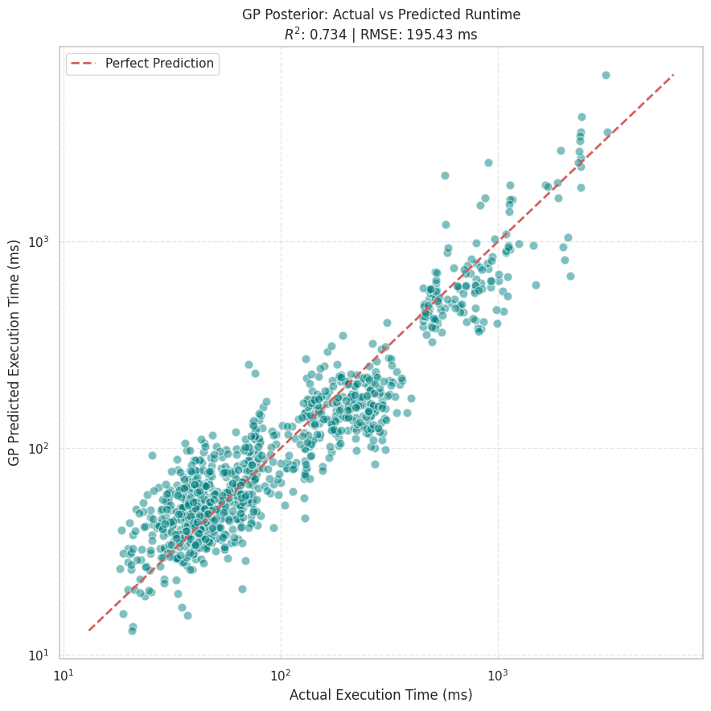

# SGEMM Gaussian Process Surrogate: GPU Kernel Performance Prediction

## Problem Statement

SGEMM (Single precision GEneral Matrix Multiply) is one of the most
computationally expensive and frequently run operations in deep learning,
scientific computing, and graphics. GPU kernels for SGEMM can be tuned with
many configuration parameters such as tile sizes, work group dimensions,
and memory access patterns. Different configurations lead to substantially
different runtimes on the same hardware. Physically benchmarking every
possible configuration (over 240,000 in the full dataset) is expensive
and slow.

This project builds a surrogate model, a Gaussian Process Regressor, that
predicts GPU kernel execution time directly from its 14 configuration
parameters without needing to run the kernel on real hardware.

## Approach

* Data: UCI SGEMM GPU kernel performance dataset, containing over 240,000
  configurations, each with four repeated runtime measurements.
* Target: mean of the four runs per configuration, log transformed to
  correct severe right skew in the raw runtimes.
* Features: 14 GPU kernel parameters (MWG, NWG, KWG, MDIMC, NDIMC, and
  others), standardized before training.
* Sampling: a random subsample of 5,000 points keeps the Gaussian Process's
  cubic time complexity computation tractable.
* Model: Gaussian Process Regression using a Matern kernel (nu equal to 1.5)
  combined with a white noise component, trained with scikit learn.
* Interpretability: a second Gaussian Process is trained with an Automatic
  Relevance Determination (ARD) kernel, using a separate length scale per
  feature, to rank which parameters most affect runtime.

## Results

Model performance on held out test configurations:

| Metric | Value |
|--------|-------|
| R squared | 0.730 |
| RMSE | approximately 197 ms |

The plot above shows predicted execution time against actual execution
time on a log log scale, with the red dashed line marking perfect
prediction. Points close to this line indicate accurate predictions across
several orders of magnitude of runtime.

ARD analysis further shows that a small subset of the 14 parameters
account for most of the variance in runtime, consistent with known GPU
memory and thread tiling bottlenecks.

## Notebooks

1. `notebooks/SGEMM.ipynb`: full pipeline covering data loading, log
   transformation, feature scaling, Gaussian Process prior and posterior
   visualization, training, evaluation, and ARD based feature importance.

## Limitations and Next Steps

* The model was trained with `n_restarts_optimizer` set to 0 for speed.
  Additional restarts may improve the kernel hyperparameter fit given more
  computational budget.
* Training used a random subsample of 5,000 points rather than the full
  dataset. A true sparse Gaussian Process method (such as SVGP, available
  through GPyTorch or GPflow) would scale to the full 240,000 point
  dataset and likely improve accuracy.
* No simpler baseline model, such as Random Forest, has been compared yet.
  Adding one would help contextualize how strong an R squared of 0.730
  actually is for this problem.
  
