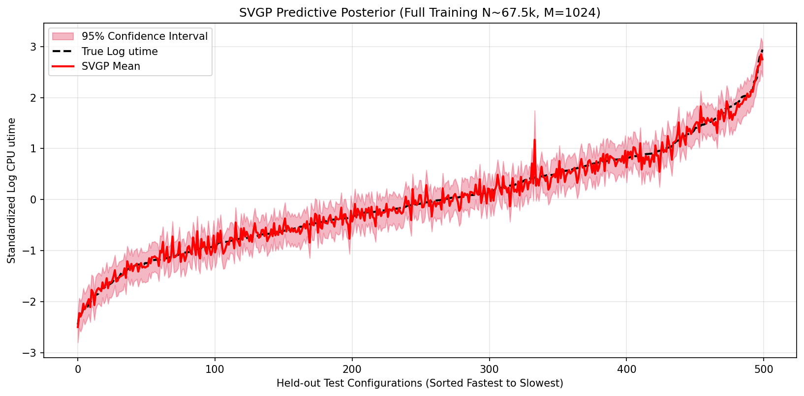

# SVGP Transcoding Time Surrogate

## Problem Statement

Predicting CPU execution time for video transcoding workloads is difficult
because hardware performance is highly non linear across codecs,
resolutions, and bitrate configurations. A standard Exact Gaussian Process
gives a mathematically principled fit and, crucially, a predictive
variance alongside its mean prediction, which is valuable for automated
hardware tuning where knowing the uncertainty of a prediction matters as
much as the prediction itself. However, an Exact GP requires inverting an
N by N covariance matrix, an operation with cubic time complexity and
quadratic memory cost in the number of training points. On this dataset,
with close to sixty eight thousand rows, fitting the full data with an
Exact GP is computationally infeasible and triggers an out of memory
crash in standard environments. This project compares an Exact GP,
necessarily subsampled to a small fraction of the data, against a Sparse
Variational Gaussian Process (SVGP) that can be trained on the entire
dataset while still preserving calibrated uncertainty estimates.

## Approach

* Sourced the Intel Core i7 Video Transcoding Benchmark Dataset from UCI,
  downloaded directly at runtime rather than stored locally.
* Cleaned the raw data, dropped identifier and memory usage columns, and
  applied a log transform to the CPU execution time target to stabilize
  its heavily skewed distribution.
* One hot encoded categorical codec fields, expanding the input space to
  roughly twenty five continuous dimensions, then standardized all
  features and the log scaled target.
* Verified the log transform visually against the raw target distribution
  and inspected a full feature correlation heatmap to confirm no perfectly
  collinear features that would break the Cholesky decomposition inside
  the Gaussian Process kernel.
* Trained an Exact Gaussian Process with an Automatic Relevance
  Determination RBF kernel on a random subsample of twenty five hundred
  points, held out from the same test set used for the SVGP, since the
  full dataset would exceed the memory available for exact inference.
* Trained a Sparse Variational Gaussian Process with one thousand and
  twenty four learned inducing points on the entire training set, using
  mini batch stochastic optimization of the variational Evidence Lower
  Bound (ELBO).
* Evaluated both models on the same held out test set and compared their
  predictive means, ninety five percent confidence intervals, RMSE, and R
  squared.

## Results

This three dimensional PCA projection visualizes the twenty five
hundred point subsample used to train the Exact Gaussian Process,
reduced from roughly twenty five dimensions down to three principal
components and colored by log scaled execution time. The visible
banding and clustering illustrate the non linear structure in hardware
execution time that the RBF kernel and its Automatic Relevance
Determination lengthscales need to capture.

This plot shows the Sparse Variational GP predictive mean and ninety
five percent confidence interval against the true log scaled execution
time for the held out test configurations, sorted from fastest to
slowest. The SVGP is trained on the entire dataset of roughly sixty
seven and a half thousand points using one thousand and twenty four
learned inducing points, so its confidence band stays tight and
consistent across the full range of test configurations rather than
degrading in sparsely sampled regions, which is the main practical
advantage this project set out to demonstrate over the memory
constrained Exact GP baseline.

## Notebooks

1. SVGP.ipynb, containing data loading and cleaning, exploratory data
   analysis, Exact GP training and evaluation on a twenty five hundred
   point subsample, and SVGP training and evaluation on the full dataset
   using one thousand and twenty four inducing points.

## Limitations and Next Steps

* The Exact GP baseline is trained on less than four percent of the
  available data, so its comparison against the SVGP somewhat overstates
  the accuracy gap that a better resourced exact method might achieve.
* Both models assume homoscedastic noise, meaning a single global noise
  variance is learned rather than one that varies with configuration,
  which likely understates uncertainty in high variance regions such as
  very high resolution or high bitrate transcodes.
* The number of inducing points for the SVGP was fixed at one thousand
  and twenty four without a systematic sweep, so there is room to study
  the accuracy versus training cost tradeoff as this number is varied.
* Next steps include comparing this SVGP result against the multi
  fidelity GP methods explored in the mfgp multi fidelity surrogate
  project, since both address the same underlying challenge of scaling
  Gaussian Process inference to larger datasets through different
  mechanisms.
